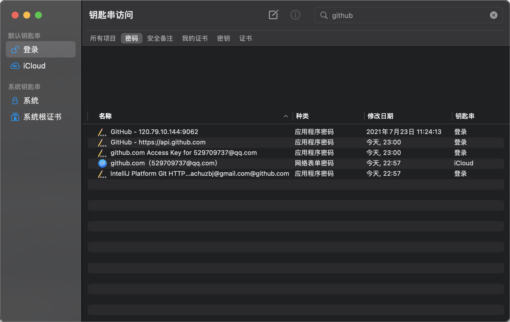

+++

author = "pikachu"
title = "hugo + github编写个人博客"
date = "2022-05-06"
description = " "
draft = false
tags = [
	"开发工具"
]
categories = [
    "it", "开发运维"
]

+++

###  hugo + github编写个人博客

- https://blog.csdn.net/qq_41136216/article/details/112674327

生成流程如下：

- 下载hugo，并配置环境变量
  - mac下载通过`brew install hugo`命令下载，如果失败，则直接到Hugo github下载extend版本的包
  - 下载完配置环境变量，mac在/etc/paths.d文件夹下添加文件并输入下载的hugo路径
  - `source [新建文件名]`会有权限问题，需要su - root在执行该命令

- `hugo new site myNewSite` 创建新项目
- 在`/content/posts` 文件夹中编写md文件
- 在`/themes` 文件夹中存入主题文件，并复制`/themes/xxx/exampleSite/config.yaml` 文件到`/`下
- 在根目录下执行 `hugo` ，`/public` 文件夹中会生成静态文件，将该文件上传到我们在github中创建的.github.io项目中，即可在打开博客。
- 本地打开：
  - 执行命令根目录下执行 `hugo server -D`
  - 进入：localhost:1313

配置记录：

- 头部加入：`draft = true`可以隐藏该md，即不被hugo构建

### github + mac 配置个人密钥

1. 在github的以下位置，生产token

2. mac搜索*Keychain*，进入以下界面，并搜索github

3. 进入相关的密钥界面，在以下红框内填入第一步生成的密钥并保存即可

